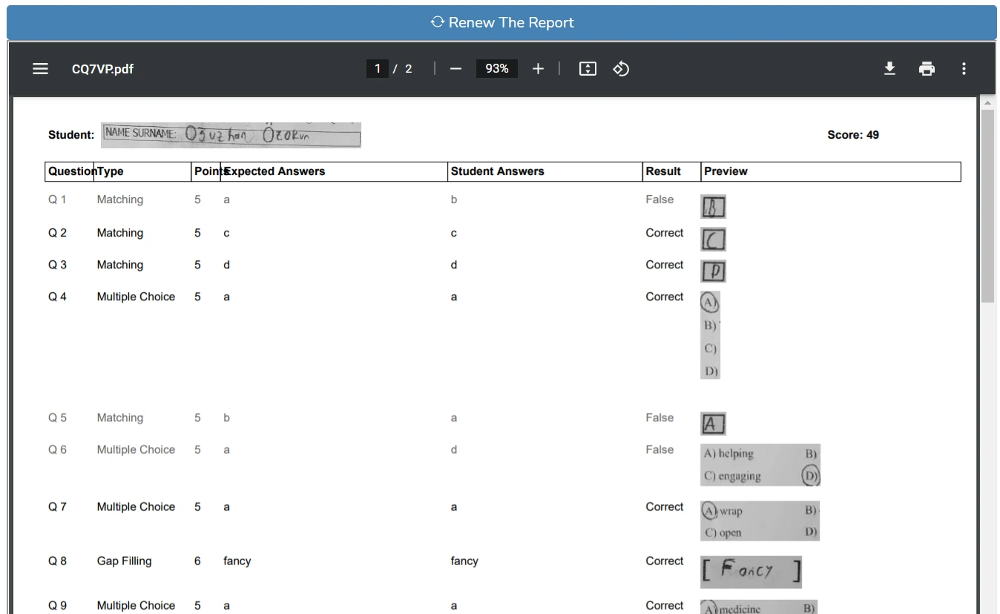

# Paper Grading
## What is it?
**It's an Computer Vision AI pipeline that can grade photo and/or scan of real exam papers.**

Paper Grading can evaluate:
* Multiple Choice
* True False
* Gap Filling *(handwritten answers)*
* Matching

type of questions. After you print an exam paper using Exam Creator in the app, fill the examination and take a photo of it and Paper Grading will evaluate the paper for you.

For details, please see [Guides.](src/templates/kilavuzlar/en) *(To take a quick peek, you can use an online HTML editor to prettify the HTMLs)*

In the image below you're looking at an example from Paper Grading. Please check Name Surname field, taken from the real paper. As the Preview column, it has the student's answers from with their handwriting. Student Answers column has the results that were predicted by Paper Grading.

## How Can I Download the AI Models?
There are 5 different AI models. One of them is an object detection model, others are image classification models. The object detection model was trained using [Detectron2](https://github.com/facebookresearch/detectron2), others were trained using [Fast.AI](https://github.com/fastai/fastai).

I uploaded AI models to Kaggle, [please find them here](https://www.kaggle.com/datasets/keremnayman/paper-grading-computer-vision-models). After downloading, move the content to `src/paper_grading/modeller`.

Unfortunately I won't provide my dataset for the models, so if you want to continue using them, you need to collect your own data and write your own training script. If you want, you can create an issua and I can try to help.

## Prerequisites
* AWS S3 Bucket
* Google Vision API Credentials
* Python 3.7+

## Installation and Configuration
Before starting, update wheel and install essential packages for Python:

`pip install --upgrade pip setuptools wheel`

`sudo apt-get install python3-dev default-libmysqlclient-dev build-essential`

First, install `requirements.txt`. After that, we need to install Detectron2 with the right version. So, run `bash detectron_install.txt` as well.

> There might be redundant packages. I haven't had time to clean them out.

There are some files that you need to configure with your information:

**Please change the files below according to your information and delete `default` from the filename. For example `.env_default` --> `.env`**

1. [config_default.py](https://github.com/keremnymn/paper-grading/tree/main/src/config_default.py)
2. [__init___default.py](https://github.com/keremnymn/paper-grading/blob/main/src/__init__%20default.py)
3. [.env_default](https://github.com/keremnymn/paper-grading/blob/main/src/.env_default)
4. [google_vision_api_credentials_default.json](https://github.com/keremnymn/paper-grading/tree/main/src/paper_grading/google_vision_api_credentials_default.json)

## Notes
* Codebase is mostly Turkish.
* It's a large project so you can expect errors or some points I forgot to explain. Feel free to create an issue.
* If you'll run the AI models without CUDA, I recommend at least 16GB RAM.

## Get in touch

</img>

